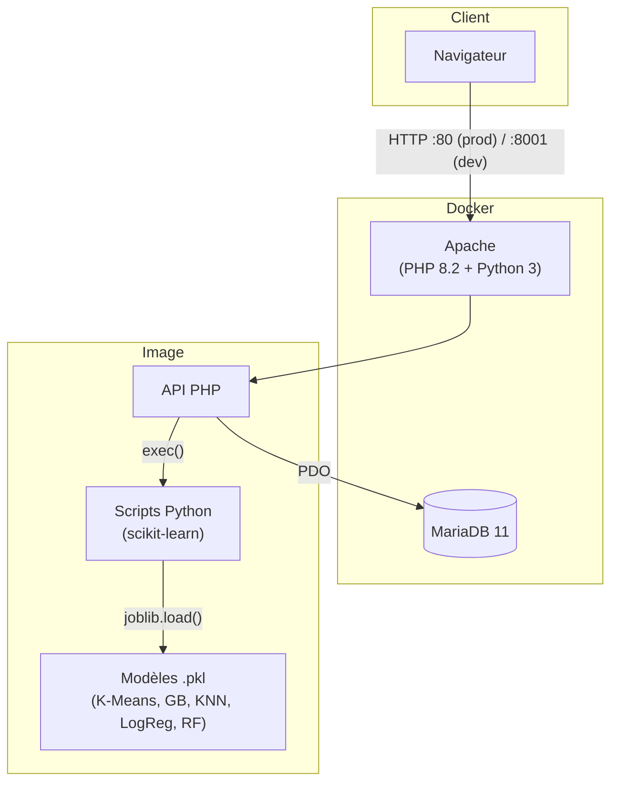
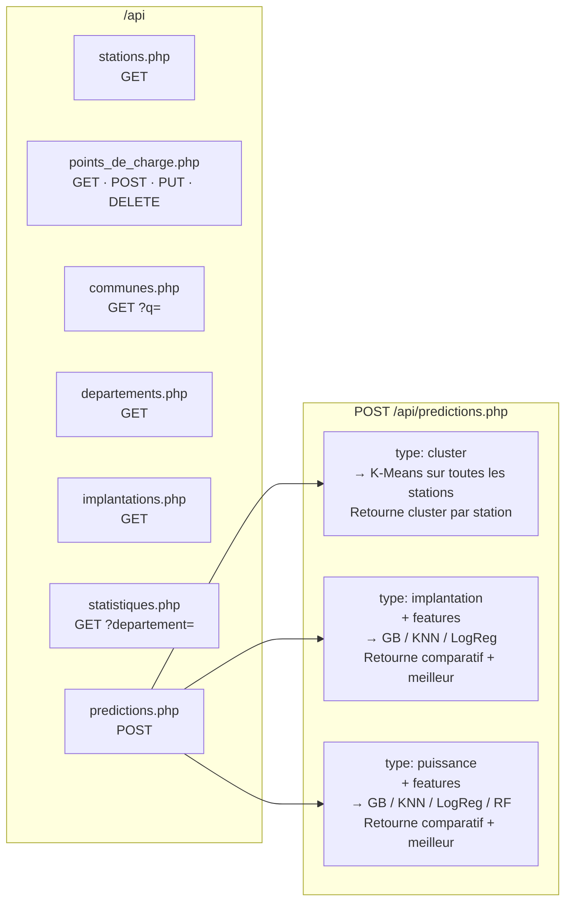
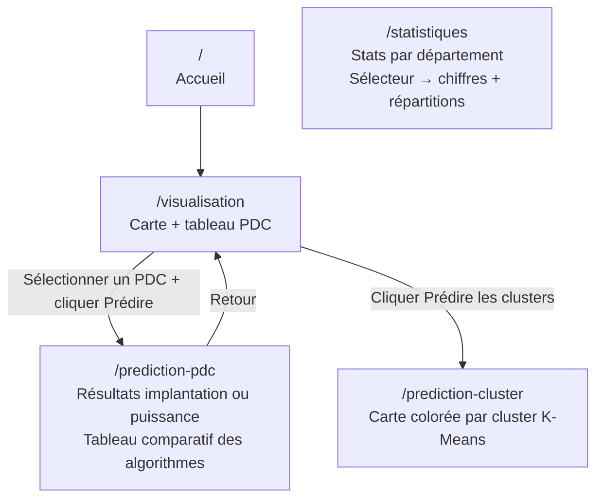

# Projet IRVE

Application web de visualisation et de prédiction des infrastructures de recharge pour véhicules électriques (IRVE) en France.

## Besoins clients

Le client souhaitait une plateforme permettant d'explorer les données nationales IRVE et d'obtenir des prédictions IA sur les bornes de recharge :

- **Visualiser** les stations sur une carte interactive et parcourir les points de charge dans un tableau paginé et filtrable
- **Consulter des statistiques** agrégées par département (nombre de stations, de PDC, puissance moyenne, répartition par implantation et condition d'accès)
- **Gérer les points de charge** via une interface CRUD complète (création, modification, suppression)
- **Prédire le type d'implantation** d'un point de charge à partir de ses caractéristiques techniques
- **Prédire la puissance nominale** d'un point de charge à partir de ses caractéristiques
- **Visualiser les clusters géographiques** de l'ensemble des stations via K-Means

---

## Architecture



---

## API



Toutes les réponses sont en JSON `{ data: ... }`. Les erreurs retournent `{ error: "..." }` avec le code HTTP approprié (400, 404, 405, 500).

**Points de charge — paramètres GET :**

| Paramètre | Type | Description |
|-----------|------|-------------|
| `id` | string | Fiche d'un PDC précis |
| `page` | int | Page (défaut : 1) |
| `limit` | int | Résultats par page, max 200 (défaut : 50) |
| `commune` | string | Filtre par nom de commune exact |
| `implantation` | string | Filtre par type d'implantation |

---

## Frontend



---

## Lancer en développement

**Prérequis :** Docker, Node.js, [Git LFS](https://git-lfs.com/) (`git lfs install`).

```bash
cp .env.example .env

# Backend + base de données
docker compose up -d --build

# Frontend (dans un autre terminal)
cd frontend && npm install && npm run dev
```

- Frontend : http://localhost:5173
- API : http://localhost:8001/api

**Commandes utiles :**

```bash
docker compose logs -f apache   # logs PHP en direct
docker compose logs -f db       # logs MariaDB
docker compose down             # arrêter (données conservées)
docker compose down -v          # arrêter + supprimer les données
```

---

## Déploiement en production

**Prérequis :** Docker (`curl -fsSL https://get.docker.com | sh`), Git LFS.

```bash
git clone https://github.com/Dackss/ProjetWeb.git
cd ProjetWeb

cp .env.example .env
# éditer .env avec les identifiants DB

git lfs pull   # télécharger les modèles IA (> 100 Mo)

# Builder le frontend
docker run --rm -v $(pwd)/frontend:/app -w /app node:22-alpine sh -c "npm install && npm run build"

# Lancer (port 80) — les scripts Python et modèles sont baked dans l'image
docker compose -f docker-compose.prod.yml up -d apache db

# Insérer les données
docker compose -f docker-compose.prod.yml run --rm python
```

**Mise à jour :**

```bash
git pull && git lfs pull
docker run --rm -v $(pwd)/frontend:/app -w /app node:22-alpine sh -c "npm install && npm run build"
docker compose -f docker-compose.prod.yml up -d --build apache
```

---

## Structure

```
frontend/   React + Vite + Tailwind CSS
backend/    API PHP (JSON), Apache, Python 3
ia/         Scripts Python (scikit-learn) + modèles .pkl
database/   Schéma SQL + données CSV
```

Les modèles `ia/models/*.pkl` sont stockés via Git LFS. Sans `git lfs pull`, le build Docker échouera.
